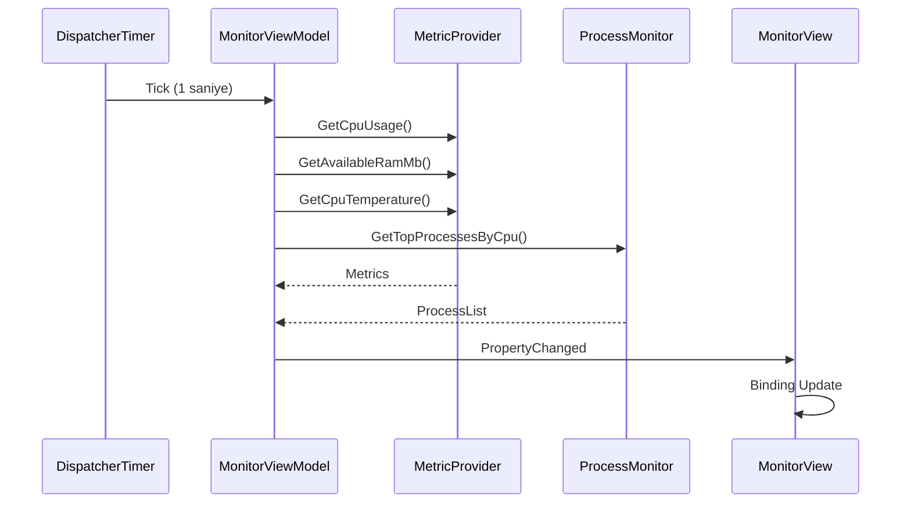
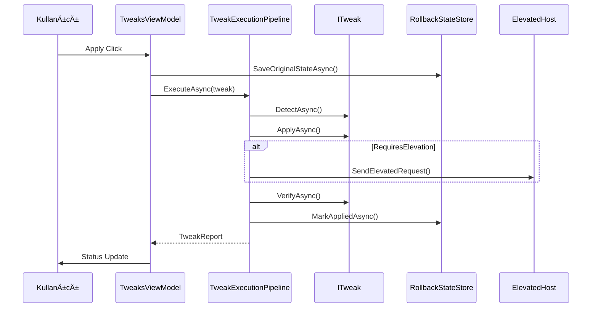

# Open Trace Project - Kapsamlı Teknik Mimari Dokümantasyonu

Bu belge, uygulamanın tüm teknik bileşenlerini, sensör fallback mekanizmalarını, thread yönetimini, UI/UX yapısını ve servis mimarisini detaylı olarak açıklar.

---

## 📁 Dosya Yapısı Özeti

```
OpenTraceProject/
├── OpenTraceProject.Core/           # Temel arayüzler ve modeller
├── OpenTraceProject.Engine/         # Tweak işleme motoru
│   └── Tweaks/                      # 9 tweak türü
├── OpenTraceProject.Infrastructure/ # Altyapı servisleri
│   └── Metrics/                     # 11 metrik dosyası (102KB+)
├── OpenTraceProject.App/            # Masaustu UI uygulamasi
│   ├── Views/                       # XAML görünümleri
│   ├── ViewModels/                  # MVVM ViewModelleri
│   └── Services/                    # Uygulama servisleri
└── OpenTraceProject.ElevatedHost/   # Yükseltilmiş işlem sunucusu
```

---

## 🔧 Servis Mimarisi

### 1. TweakProvider Sistemi (13 dosya)

Provider'lar `OpenTraceProject.App/Services/TweakProviders/` dizininde bulunur:

| Provider | Sorumluluk | Tweak Sayısı |
|----------|------------|--------------|
| `AudioTweakProvider` | Ses ayarları (beep, ducking) | ~6 |
| `NetworkTweakProvider` | AÄŸ optimizasyonu (IPv6, SMB) | ~30+ |
| `PerformanceTweakProvider` | Animasyonlar, throttling | ~8 |
| `PeripheralTweakProvider` | Mouse, keyboard | ~10 |
| `PrivacyTweakProvider` | Telemetri, konum | ~70+ |
| `SecurityTweakProvider` | UAC, firewall, VBS | ~15 |
| `SystemTweakProvider` | Servisler, görevler | ~25 |
| `SystemRegistryTweakProvider` | Kernel, NTFS, DWM | ~30 |
| `VisibilityTweakProvider` | UI öğeleri, spotlight | ~25 |
| `MiscTweakProvider` | DiÄŸer uygulamalar | ~5 |
| `LegacyTweakProvider` | Eski tweak kataloÄŸu | ~100+ |

### 2. Metrik Servisleri (11 dosya, 180KB+)

**Dosyalar:**
- `MetricProvider.cs` (102KB, 3053 satır) - Ana sensör sağlayıcı
- `ProcessMonitor.cs` (26KB, 908 satır) - İşlem izleme
- `NetworkMonitor.cs` (12KB, 340 satır) - Ağ adaptörleri
- `DiskMonitor.cs` (5.7KB) - Disk I/O
- `NetworkEtwSampler.cs` (3.9KB) - ETW ağ örnekleme
- `NetworkLatencyMonitor.cs` (3.4KB) - Ping/latency
- `WifiSignalMonitor.cs` (9.5KB) - WiFi sinyal gücü
- `GpuEngineMonitor.cs` (4KB) - GPU motor kullanımı
- `BootTimeTracker.cs` (9.2KB) - Boot süresi analizi
- `KernelImpactAnalyzer.cs` (1.5KB) - Çekirdek etkisi
- `PerformanceSnapshots.cs` (1.7KB) - Anlık snapshot modelleri

---

## 🔌 Sensör ve Fallback Mekanizmaları

### CPU Sıcaklık Fallback Zinciri

```mermaid
graph TD
    A[LibreHardwareMonitor Sensörleri] -->|Başarısız| B[WMI MSAcpi_ThermalZoneTemperature]
    B -->|Başarısız| C["N/A" döndür]
```



**Kod:** `MetricProvider.GetCpuTemperature()` (satır 210-263)

### CPU Hız Fallback Zinciri

```mermaid
graph TD
    A[LibreHardwareMonitor Clock Sensörleri] -->|Başarısız| B[WMI Win32_Processor.CurrentClockSpeed]
    B -->|Başarısız| C[WMI Win32_PerfFormattedData_Counters]
    C -->|Başarısız| D[Base Clock döndür]
```



**Kod:** `MetricProvider.TryGetCpuCurrentSpeedMhz()` (satır 1678-1826)

### GPU Bellek Fallback Zinciri

```mermaid
graph TD
    A[LibreHardwareMonitor GPU Memory Sensörleri] -->|Başarısız| B[PerformanceCounter GPU Dedicated Memory]
    B -->|Başarısız| C[Registry DirectX Version + WMI]
    C -->|Başarısız| D["N/A" döndür]
```



**Kod:** `MetricProvider.TryGetGpuMemoryTotalMb()` (satır 2524-2620)

### AÄŸ Ä°ÅŸlem TrafiÄŸi Fallback Zinciri

```mermaid
graph TD
    A[ETW Network Sampler] -->|Başarısız veya Admin değil| B[TCP EStats API]
    B -->|Başarısız| C[Process I/O Counters Approximate]
```



**Kod:** `ProcessMonitor.GetTopProcessesByNetwork()` (satır 160-218)

```csharp
public List<ProcessInfo> GetTopProcessesByNetwork(int count = 10)
{
    // 1. ETW (en doÄŸru, admin gerektirir)
    if (TryGetEtwBytesByPid(out var etwBytes))
    {
        mode = NetworkProcessMode.TcpUdpEtw;
    }
    // 2. TCP EStats (orta doÄŸruluk)
    else if (TryGetTcpBytesByPid(out var tcpBytes))
    {
        mode = NetworkProcessMode.TcpOnly;
    }
    // 3. Yaklaşık I/O (düşük doğruluk)
    else
    {
        return GetTopProcessesByIo(count); // Fallback
    }
}
```

### Disk Sağlığı Fallback Zinciri

```mermaid
graph TD
    A[LibreHardwareMonitor Storage Sensörleri] -->|Başarısız| B[WMI MSStorageDriver_FailurePredictStatus]
    B -->|Başarısız| C[WMI MSFT_PhysicalDisk.HealthStatus]
    C -->|Başarısız| D[WMI Win32_DiskDrive.Status]
    D -->|Başarısız| E["Unknown" döndür]
```



**Kod:** `MetricProvider.GetDiskHealthSnapshot()` (satır 654-716)

---

## 🧵 Thread ve Performans Yönetimi

### DispatcherTimer Kullanımı

`MonitorViewModel.cs` ana timer'ı kontrol eder:

```csharp
// Timer aralığı: 1 saniye
private readonly DispatcherTimer _timer = new()
{
    Interval = TimeSpan.FromSeconds(1)
};

// UI thread'inde çalışır
private void Timer_Tick(object? sender, EventArgs e)
{
    UpdateMetrics();
}
```

### Background Thread Kullanımı

**I/O yoÄŸun iÅŸlemler Task.Run ile arka planda:**

```csharp
// Sensör güncellemeleri
await Task.Run(() => _metricProvider.UpdateHardware());

// Ä°ÅŸlem listesi
var processes = await Task.Run(() => _processMonitor.GetTopProcessesByCpu());
```

### CollectionView Thread Güvenliği

**UI thread'ine deferral ile güncelleme:**

```csharp
await _dispatcherService.RunOnUIThreadAsync(() =>
{
    CollectionViewSource.GetDefaultView(collection).Refresh();
});
```

### WMI Scope Bağlantı Yönetimi

**Lazy initialization pattern:**

```csharp
private ManagementScope? _storageScope;

private bool TryConnectStorageScope()
{
    if (_storageScope?.IsConnected == true) return true;

    _storageScope = new ManagementScope(@"\\.\root\WMI");
    _storageScope.Connect();
    return _storageScope.IsConnected;
}
```

---

## 🎨 UI/UX Mimarisi

### MonitorView.xaml Yapısı (2734 satır)

**Ana Bölümler:**

| Bölüm | Satır Aralığı | İçerik |
|-------|---------------|--------|
| Resources | 1-620 | Styles, Converters, Gradients |
| MonitorSystemInfoTemplate | 561-620 | Sistem bilgisi kartı |
| MonitorPerformanceTemplate | 622-785 | Performans grafikleri |
| MonitorStatCardsTemplate | 787-1200 | CPU/RAM/Disk/Network kartları |
| Process Lists | 1200-2200 | İşlem tabloları |
| Network/Disk Sections | 2200-2734 | Adaptör ve disk listeleri |

### Animasyon Sistemi

**Card Reveal Animation:**
```xml
<DoubleAnimation From="0" To="1" Duration="0:0:0.35"/>
<DoubleAnimation From="12" To="0" Duration="0:0:0.35"/> <!-- TranslateY -->
```

**Hover Scale Animation:**
```xml
<DoubleAnimation To="1.015" Duration="0:0:0.12"/> <!-- ScaleX/Y -->
```

**Chart Glow Effects:**
```xml
<DropShadowEffect Color="Nord8" BlurRadius="10" Opacity="0.7"/>
```

### Gradient Sistemleri

| Gradient | Renk | Kullanım |
|----------|------|----------|
| `CpuAreaGradient` | Cyan | CPU grafik alanı |
| `RamAreaGradient` | Green | RAM grafik alanı |
| `DownloadAreaGradient` | Green | İndirme çizgisi |
| `UploadAreaGradient` | Cyan | Yükleme çizgisi |
| `DiskReadAreaGradient` | Green | Disk okuma |
| `DiskWriteAreaGradient` | Red | Disk yazma |

### Tema DesteÄŸi

**DynamicResource kullanımı:**
```xml
Background="{DynamicResource BackgroundDarkestBrush}"
Foreground="{DynamicResource ForegroundBrightestBrush}"
```

**Tema dosyaları:**
- `Resources/Colors.xaml` - Dark theme
- `Resources/Colors.Light.xaml` - Light theme

---

## 📊 Veri Akışı

### Monitor Veri Akışı



### Tweak Uygulama Akışı



---

## 🔒 Güvenlik ve Yetkilendirme

### ElevatedHost Mimarisi

**Named Pipe Ä°letiÅŸimi:**
```
Pipe Name: OpenTraceProjectElevatedPipe
Security: Admin only access
```

**İstek Türleri:**
- Registry yazma (HKLM, HKCR)
- Servis yönetimi
- Zamanlanmış görev yönetimi
- Sistem komutları (bcdedit, powercfg)

### Process Yönetimi P/Invoke

```csharp
// Thread durdurma/devam ettirme
[DllImport("kernel32.dll")]
private static extern IntPtr OpenThread(ThreadAccess dwDesiredAccess, ...);

[DllImport("kernel32.dll")]
private static extern uint SuspendThread(IntPtr hThread);

// I/O sayaçları
[DllImport("kernel32.dll")]
private static extern bool GetProcessIoCounters(IntPtr hProcess, out IoCounters ioCounters);

// TCP bağlantı istatistikleri
[DllImport("iphlpapi.dll")]
private static extern uint GetExtendedTcpTable(...);

[DllImport("iphlpapi.dll")]
private static extern uint GetPerTcpConnectionEStats(...);
```

---

## 📈 Performans Optimizasyonları

### Bellek Yönetimi

| Özellik | Uygulama |
|---------|----------|
| Dictionary temizleme | `ProcessMonitor.Cleanup()` ölü PID'leri kaldırır |
| Lazy loading | WMI scope'ları lazy init |
| Dispose pattern | Tüm monitor'lar IDisposable |
| Object pooling | PerformanceCounter reuse |

### CPU Optimizasyonu

| Teknik | Açıklama |
|--------|----------|
| Delta hesaplama | CPU/IO için önceki değerle karşılaştırma |
| Batch processing | Tüm process'leri tek sorguda al |
| Caching | WMI sonuçlarını cache'le |
| Throttling | 1 saniye minimum güncelleme aralığı |

---

## 🐛 Bilinen Sorunlar ve Çözümler

| Sorun | Sebep | Çözüm |
|-------|-------|-------|
| GPU temp N/A | LibreHardwareMonitor driver eksik | Fallback WMI kullan |
| Network list boş | Adapter adı eşleşmiyor | Instance name normalization |
| CPU speed 0 | WMI sorgu hatası | Multiple fallback zinciri |
| High memory | Timer leak | Dispose pattern uygula |

---

## 📚 Referanslar

- [LibreHardwareMonitor](https://github.com/LibreHardwareMonitor/LibreHardwareMonitor)
- [WMI Classes Reference](https://learn.microsoft.com/en-us/windows/win32/cimwin32prov)
- [PerformanceCounter Class](https://learn.microsoft.com/en-us/dotnet/api/system.diagnostics.performancecounter)
- [GetProcessIoCounters](https://learn.microsoft.com/en-us/windows/win32/api/winbase/nf-winbase-getprocessiocounters)
- [GetExtendedTcpTable](https://learn.microsoft.com/en-us/windows/win32/api/iphlpapi/nf-iphlpapi-getextendedtcptable)
- [Desktop animation](https://learn.microsoft.com/en-us/dotnet/desktop/wpf/graphics-multimedia/animation-overview)
