# WPF-Windows-optimizer-with-safe-reversible-tweaks

A Windows optimizer built in WPF that focuses on safe, reversible tweaks. Every tweak follows Detect -> Apply -> Verify -> Rollback, with Preview (dry-run) as a first-class path.

## Purpose
This app aims to make system tuning repeatable and transparent. It separates UI from tweak logic, keeps admin-only operations in a separate elevated process, and logs every action so changes can be audited and reversed.

## Design goals
- Safety first: detect state before changes, verify after, rollback on failure.
- Preview by default: DryRun support is built into the pipeline.
- Explicit risk levels: Safe, Advanced, Risky (Safe does not include disabling Defender, Firewall, or SmartScreen).
- Admin operations run through ElevatedHost; the UI process is not always elevated.
- Logs and export: every step written to app log and CSV.

## How the code is written
- **Modern WPF MVVM shell** with Nord-inspired theme, smooth animations, and 60 FPS transitions.
- **Centralized theming**: Colors, Styles, Animations in `WindowsOptimizer.App/Resources/`.
- **Smooth navigation**: Page transitions with fade and slide effects using Microsoft.Xaml.Behaviors.
- **Performance monitoring**: Built-in FPS counter tracks rendering performance.
- `ITweak` implementations stay small and composable; multi-step changes use composite tweaks.
- Engine pipeline owns execution flow, progress reporting, and rollback rules.
- Infrastructure adapters isolate OS concerns (registry, services, tasks, file system).
- ElevatedHost handles privileged actions over a named pipe with JSON messages.

## How tweaks are implemented
Tweaks implement `WindowsOptimizer.Core.ITweak` with four actions: `Detect`, `Apply`, `Verify`, `Rollback`.
The engine runs them through `TweakExecutionPipeline` which:
- captures state during Detect,
- applies only when DryRun is false,
- verifies when enabled,
- rolls back automatically on failures (or on demand).

Implemented tweak types include:
- Registry value tweaks (single + batch).
- Settings toggles stored in `settings.json`.
- Composite tweaks that chain multiple sub-tweaks.
- Service start mode batches with optional stop behavior.
- Scheduled task enable/disable batches.
- File rename toggles for system executables.
- **Command-based tweaks** that execute System32 commands (powercfg, DISM, bcdedit) through an allowlist security model.

## Architecture overview
- `WindowsOptimizer.App`: WPF UI, filters, bulk commands, and execution status.
- `WindowsOptimizer.Core`: tweak contracts, enums, and result types.
- `WindowsOptimizer.Engine`: execution pipeline + tweak implementations (registry, services, tasks, files, **commands**).
- `WindowsOptimizer.Infrastructure`: adapters (registry, services, tasks, files, **commands with allowlist**), settings, logging.
- `WindowsOptimizer.ElevatedHost`: separate admin process (named pipes + JSON messages) - handles registry, services, tasks, files, and **command execution**.
- `WindowsOptimizer.Tests`: unit tests for contracts, adapters, and tweak logic.

## Data and logs
- Settings: `%AppData%\\WindowsOptimizerSuite\\settings.json`
- App log: `%AppData%\\WindowsOptimizerSuite\\logs\\app.log`
- Tweak log: `%AppData%\\WindowsOptimizerSuite\\logs\\tweak-log.csv`
- Logs can be exported via `ITweakLogStore.ExportCsvAsync` and the UI action.

## Build and run
- `dotnet build WindowsOptimizerSuite.slnx`
- `dotnet run --project WindowsOptimizer.App`

## Docs and backlog
The `Docs` tree is the source of truth for tweak intent and safety notes. It also acts as the feature backlog for what should be implemented or validated next.

## Status dashboard (estimate)

Auto snapshot based on Docs + current tweak list. Update with `python3 scripts/update_readme_progress.py`.

<!-- progress:summary:start -->
| Area | Progress | Notes |
| --- | --- | --- |
| Tweaks coverage (docs) | 75% (174/233) <progress value="75" max="100"></progress> | Top-level tweak IDs vs docs headings (coverage capped at 100%) |
| Monitoring | 30% <progress value="30" max="100"></progress> | Pipeline updates + logs exist, richer dashboards pending |
| UI/UX shell | 75% <progress value="75" max="100"></progress> | Modern theme, smooth animations, 60 FPS transitions, centralized resources |
| Elevation | 85% <progress value="85" max="100"></progress> | ElevatedHost + registry/services/tasks/files/commands |
| Logging/export | 75% <progress value="75" max="100"></progress> | app.log + tweak-log.csv + export |
| Tests | 25% <progress value="25" max="100"></progress> | Unit tests for pipeline/tweaks/adapters |
| Docs/guides | 35% <progress value="35" max="100"></progress> | Docs exist, README expanding |
<!-- progress:summary:end -->

<!-- progress:tweaks:start -->
| Doc Area | Implemented | Total | Coverage |
| --- | --- | --- | --- |
| affinities | 0 | 1 | 0% |
| cleanup | 2 | 22 | 9% |
| misc | 0 | 13 | 0% |
| network | 27 | 22 | 100% |
| peripheral | 9 | 19 | 47% |
| policies | 0 | 1 | 0% |
| power | 6 | 22 | 27% |
| privacy | 64 | 38 | 100% |
| security | 19 | 24 | 79% |
| system | 25 | 39 | 64% |
| visibility | 22 | 32 | 69% |
| total | 174 | 233 | 75% |
<!-- progress:tweaks:end -->

<!-- progress:overall:start -->
General completion: 50%
<!-- progress:overall:end -->

## Automation
- `scripts/codex_pr.sh` opens or updates a PR from the current branch and leaves `@codex review`.
- Requires GitHub CLI (`gh`) with `gh auth login`.
- Usage: `scripts/codex_pr.sh "Title" "Body"`.
- Optional env vars: `BASE_BRANCH`, `CODEX_COMMENT`, `GH_BIN`.

## Recent Development Sessions

### Session 2025-12-22: UI Polish & Feature Expansion
- **Enhanced Dashboard**: Statistics cards showing tweaks available, applied, and rolled back
- **Improved About Page**: Comprehensive application information, features, safety notes, and project details
- **Settings Page**: Discord webhook integration UI with test functionality
- **18 New Tweaks Added**:
  - **Performance** (5): Disable Superfetch, Windows Search, Window Animations, Menu Delay, Taskbar Animations
  - **Privacy** (3): Disable Activity History, App Diagnostics, Location Tracking
  - **Explorer** (3): Show Hidden Files, File Extensions, Full Path in Title
  - **Network** (2): Flush DNS Cache, Reset Winsock Catalog
  - **System** (5): Check Disk Health, Clear Event Logs, Disable Startup Delay, Remove Shortcut Arrow, Verbose Status
- **Expanded Command Allowlist**: Added sc.exe, ipconfig.exe, netsh.exe, chkdsk.exe, wevtutil.exe with 40+ safe operations
- **Total Tweaks**: 110+ optimizations now available!

### Session 2025-12-21: Foundation & Integration
- **Phase 1 - Modern UI Foundation**:
  - Nord-inspired theme with centralized color palette
  - 60 FPS page transitions with fade and slide effects
  - Performance monitoring with built-in FPS counter
  - Modern card styles with glassmorphism effects
- **Phase 2 - Command-Based Tweaks**:
  - Command execution framework with security allowlist
  - ElevatedHost integration for privileged commands
  - 4 initial command tweaks (Power + Cleanup)
  - Allowlisted: powercfg.exe, DISM.exe, bcdedit.exe
- **Phase 3 - Discord Integration**:
  - Discord webhook client with rich embeds
  - Automatic patch file packaging and uploads
  - Settings integration for webhook configuration
