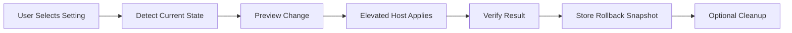

# RegProbe

<p align="center">
  
</p>

**Evidence-first Windows registry research and safer configuration tooling.**

RegProbe investigates, validates, and applies Windows registry-backed settings with a strong bias toward proof, reversibility, and controlled rollout. Instead of treating registry advice like folklore, RegProbe treats every setting like a claim that needs evidence: what changes, why it matters, how it was validated, and how to undo it.

That is the public product promise and the repo contract underneath it. The desktop app is the calm surface. The research pipeline, VM lanes, traces, audits, and static-analysis exports are the proof system behind it.


[](https://github.com/siklone/RegProbe/actions/workflows/dotnet.yml)

## Product Preview

The repo keeps a small preview lane so the shipped shell is visible before the deeper research prose starts. The images below are the current repo-tracked product captures described in [Product media](Docs/product/media.md).

<table>
  <tr>
    <td width="50%">
      
    </td>
    <td width="50%">
      
    </td>
  </tr>
  <tr>
    <td><strong>Tweaks workspace</strong><br>The main shell is now a research-card desk: category rail, stacked cards, proof chips, and a dedicated analysis sheet.</td>
    <td><strong>Evidence detail</strong><br>Plain-English effect, hold state, proof tabs, and analysis bars stay in one place instead of leaking into repo-only context.</td>
  </tr>
  <tr>
    <td width="50%">
      
    </td>
    <td width="50%">
      
    </td>
  </tr>
  <tr>
    <td><strong>Recovery</strong><br>Rollback and cleanup now feel first-class, with queue state and restore history visible in the same shell.</td>
    <td><strong>Diagnostics</strong><br>Version, repo context, and logs moved into a calmer utility page instead of hiding behind scattered menus.</td>
  </tr>
</table>

## What RegProbe Does

- Detects current registry-backed setting state before making changes
- Shows what a change means before apply
- Separates standard app logic from elevated operations
- Tracks evidence quality per setting
- Records rollback expectations explicitly
- Distinguishes research-only findings from shippable actions

## What RegProbe Does Not Do

- Blindly apply popular tweak lists
- Treat community claims as proof
- Assume a policy surface proves runtime behavior
- Ship risky settings without rollback expectations
- Auto-apply changes on startup

## Safety Model

RegProbe follows this flow:

`Detect -> Preview -> Apply -> Verify -> Record rollback`

That means changes are meant to be deliberate, inspectable, and reversible.


```mermaid
flowchart LR
    A["User Selects Setting"] --> B["Detect Current State"]
    B --> C["Preview Change"]
    C --> D["Elevated Host Applies"]
    D --> E["Verify Result"]
    E --> F["Store Rollback Snapshot"]
    F --> G["Optional Cleanup"]
```

## How To Read A Setting

Every serious setting in RegProbe should answer four questions:

1. What is it?
2. How strong is the proof?
3. Can I safely apply it?
4. How do I undo it?

The longer contributor walkthrough lives in [How to read a record](Docs/research/how-to-read-a-record.md).

## Evidence Model

RegProbe separates three layers of confidence.

### 1. Control Surface Proof

This shows that Windows exposes or recognizes the setting.

- official documentation
- ADMX / CSP / policy mapping
- known registry write surface
- app or provider mapping

### 2. Runtime Proof

This shows that changing the value produces meaningful behavior on real systems or controlled VMs.

- VM before/after validation
- Procmon / ETW / WPR traces
- observed service or component reads
- controlled reproduction artifacts

### 3. Shipping Decision

This determines whether RegProbe should expose the setting for users.

- apply allowed
- visible but blocked
- research-only
- archived or negative evidence
- revalidation required for newer builds

The proof model and vocabulary are documented in more detail in [Proof model and visual grammar](Docs/research/proof-model.md).

## Badge Legend

| Badge | Meaning |
|--------|---------|
| `Docs` | Official documentation or primary source found |
| `Policy` | ADMX, CSP, group policy, or control surface confirmed |
| `VM` | Tested in a controlled virtual environment |
| `Trace` | Runtime activity captured via Procmon, ETW, or WPR |
| `RE` | Reverse engineering supported interpretation |
| `Rollback` | Rollback path explicitly tested |
| `No-hit` | Researched, but runtime evidence is insufficient |
| `Experimental` | Not ready for normal user-facing apply flow |

## Status Meanings

| Status | Meaning |
|--------|---------|
| `Recommended` | Sufficient evidence and rollback confidence |
| `Experimental` | Promising, but still under validation |
| `Research-only` | Useful record, not safe to expose for apply |
| `Blocked` | Known control surface, insufficient runtime proof |
| `Archived` | Retained to avoid rediscovering dead ends |

## Start Here

- I want to use the app: [User guide](Docs/product/user-guide.md)
- I want the public support story: [Support matrix](Docs/product/support-matrix.md)
- I want to build the app: [Build and run](#build-and-run)
- I want to contribute research: [Contributing](CONTRIBUTING.md)

The docs are now split the same way the repo is meant to feel from the outside: [Docs/product](Docs/product/README.md) for public-facing usage and trust signals, [Docs/research](Docs/research/README.md) for contributor and validation depth.

## What Ships Today

The shipped app is a focused three-surface shell with persistent top-level navigation: `Tweaks`, `Recovery`, and `Diagnostics`. The current UI is deliberately tighter than older builds: dark, card-first, and more interested in exposing research than in showing off.

- `Tweaks` is now an analysis desk. A category rail sits on the left, research cards stack in the center, and the selected item expands into a larger evidence-first detail sheet with proof tabs, hold state, and rollback context.
- `Recovery` reuses the same shell chrome but narrows the job to rollback, cleanup, and restore visibility. The queue and history are both visible enough to feel operational.
- `Diagnostics` opens the utility page titled `About & Diagnostics`, where version, runtime context, repository pointers, and local log access stay in one calmer place.

That restraint is intentional. Older surfaces such as the hardware dashboard, services browser, bloatware browser, startup manager, disk-health area, and the older policy-heavy shell are not part of the current shipped experience. Contributor-only evidence metadata still exists, but it stays behind repo and developer gating instead of turning the app into a research database with buttons.

## For Contributors

Everything below this point is mostly contributor depth: evidence policy, VM workflow, research health, audit surfaces, and the mechanics used to decide whether a tweak is safe enough to ship. If you only wanted the quick adoption path, you can stop at the build and run section and come back later.

## Core Principles

RegProbe does not mutate the system on startup. SAFE tweaks follow `Detect -> Apply -> Verify -> Rollback`, and elevated work goes through `RegProbe.ElevatedHost` instead of the main process. The happy path is not "click and hope"; it is "preview, apply deliberately, verify, and keep a restore story."

Runtime validation belongs in the VM, not on the host. If a setting touches kernel, boot, driver, power, or system policy behavior, the repo expects a mapped runtime lane before that evidence is treated as executed proof. Static analysis can narrow the path, but it does not get to pretend it is a live capture.

The research posture is evidence-first, not folklore-first. The checked-in v3.6 publishing lane keeps the retained v3.2 static-hardening cleanup honest: committed Ghidra artifacts are still PDB-backed and bounded, the broken-link and ghidra-bloat queues stay closed, Nohuto priority records were re-audited first, and `IDA` is optional while `Ghidra + PDB` remains the normal static lane.

## Evidence Contract

This section stays technical because it is the contributor contract. The first quality-hardening pass changed what counts as evidence:

- `full-evidence.json.artifact_refs` are structured objects, not loose strings.
- Every physical artifact carries `path`, `sha256`, `size`, and `collected_utc`.
- `staged` manifests are allowed as planning state, but they are not treated as captured evidence.
- Runtime lanes that claim live capture must point to physical ETL, PML, JSON, or equivalent artifacts, or they are downgraded to `missing-capture`.
- Kernel, boot, and driver-facing records must finish with a real mapped runtime lane before they can count as executed evidence.

If you see a manifest without capture artifacts, treat it as orchestration metadata, not proof.

## Where The Research Stands

The research workspace is now less about running one-off experiments and more about keeping a living, auditable map of what has been proven. It tracks evidence freshness by tested Windows build, keeps regression history for revalidation after major build changes, records tweak interactions and dependency datasets, and carries anti-cheat or DRM advisory risk tags where they are known. The current validation baseline also has a reproducibility manifest, so a future run can tell whether it is comparing like with like.

Negative evidence matters here. Archived and no-hit records are not just shrugged away; their failed traces, missing captures, and narrowed hypotheses are published so the same dead ends do not get rediscovered later. Useful entry points are the [Regression history](research/regression-history.json), the [Negative evidence index](research/evidence-not-found/index.json), and the retained historical [Pipeline v3.1](registry-research-framework/docs/pipeline-v3.1.md) notes.

Collection mode is explicit now. `evidence` is the safe default for research and audits: automatic rollback is suppressed, pre-change and post-change exports are expected, and manifests carry `rollback_pending = true` until a later explicit cleanup run. `operational` keeps the older convenience behavior for flows where automatic rollback is intentionally allowed, but it is not the default for evidence collection.

VM secret handling was also tightened. Repo-tracked VM scripts no longer keep plaintext guest passwords. Credentials are resolved from explicit input first, then environment variables such as `REGPROBE_VM_GUEST_USER` and `REGPROBE_VM_GUEST_PASSWORD`, and finally from a DPAPI-protected CLIXML credential file referenced outside the repo. `vmrun` still consumes credentials at invocation time because that is a VMware CLI limitation, but the repo avoids storing or logging those secrets directly and the shared VM helper masks them in runner output.

For hard runtime cases, the escalation path extends beyond "reboot and idle." The current path moves from targeted `ETW` or runtime trace work, to the safe mega-trigger runtime lane, to `WinDbg` boot registry tracing when QGA allows it, and then to source-enrichment cross-reference through `ReactOS`, `WRK`, `System Informer`, `Sandboxie`, `Wine`, `ADMX`, and `WDK`. ETL discovery feeds the queue, feature-area enrichment and triage narrow the candidate set, VM safety bench results promote only the profiles that meet the retained bar, and hard blockers record the missing prerequisite instead of collapsing into generic review language. Some lanes are still intentionally held, but they are held with reasons: exact runtime reads are missing, the VM cannot expose the right power state, or the probe is boot-unsafe without a dedicated lane.

For the full validation flow, start with the [VM workflow](Docs/research/vm-workflow.md), [Runtime escalation](Docs/research/runtime-escalation.md), and the historical [Pipeline v3.1](registry-research-framework/docs/pipeline-v3.1.md) reference when an older audit pack still points to it.

## Research Health

<!-- BEGIN:RESEARCH_HEALTH -->
| Metric | Value |
|--------|-------|
| Promoted | 250 |
| Blocked | 18 |
| Revalidation Pending | 0 |
| Gate Health | green |
| Schema Complete | 100% |
| Missing Docs | 0 |
<!-- END:RESEARCH_HEALTH -->

## Repo Shape

```text
app/                         WPF shell, views, view models, resources
core/                        Contracts and shared models
engine/                      Tweak implementations and execution pipeline
infrastructure/              Registry, file, process, and elevation adapters
elevated-host/               Separate admin helper process
cli/                         Command-line entry point
tests/                       Unit and behavior tests
research/                    Human-facing records, notes, audit outputs
evidence/                    Bundles and imported runtime/static artifacts
registry-research-framework/ historical v3.1/v3.2 machine-pipeline docs and retained tooling
Docs/                        Workflow and contributor-facing docs
scripts/                     Build, package, VM, and validation helpers
```

## VM Reality

The supported validation VM is `Win25H2Clean`, and the current canonical snapshot is `RegProbe-Baseline-ToolsHardened-20260330`.

The baseline is tooling-first. Defender stays enabled, exclusions are bounded to trusted tooling, app payloads do not persist in the saved baseline, and app launch smoke is allowed only as an ephemeral deploy/validate/cleanup lane. The details matter because registry evidence collected from a messy VM is worse than no evidence: it looks authoritative while quietly carrying someone else's state.

Start with the [VM workflow](Docs/research/vm-workflow.md) when you need the whole flow, and use [Runtime escalation](Docs/research/runtime-escalation.md) when a value needs more than a simple before/after check.

## Scripts

The repo has a lot of PowerShell, but not every script has the same job. Some scripts are everyday build, package, clean, baseline maintenance, shell-health, and app-smoke helpers. Some are active research runners for current escalation lanes. Others are historical reproducibility scripts kept because old notes, audits, and evidence bundles still depend on them.

Regenerable clutter such as `bin/`, `obj/`, `publish/`, `dist/`, and `TestResults/` can be cleaned freely. Narrow `.ps1` runners should be treated more carefully; many exist so an old evidence claim can still be replayed. The full map lives in the [Script catalog](Docs/research/script-catalog.md), and it is worth reading before deleting anything that looks oddly specific.

## Where To Start If You Want To Learn

Start with this [README](README.md) and [Contributing](CONTRIBUTING.md), then move to the [VM workflow](Docs/research/vm-workflow.md) and the [script catalog](Docs/research/script-catalog.md). After that, open the [research atlas](research/evidence-atlas.md), pick one record under [research/records](research/records), and read it next to its matching bundle under [evidence/records](evidence/records). That path gives you the "what", the "how", and the proof trail in the same order most contributors discover it.

## Download

The latest release is available on the [Releases page](https://github.com/siklone/RegProbe/releases/latest).

### Verify The Download

Each release includes a SHA256 checksum file.

```powershell
Get-FileHash .\RegProbe-Portable-v0.0.0-win-x64.zip -Algorithm SHA256
```

Compare the output against the `RegProbe-<version>-win-x64-sha256.txt` file published with the same release.

### Available Packages

| Package | Description |
|--------|-------------|
| `RegProbe-Portable-<version>-win-x64.zip` | Portable desktop build, recommended |
| `RegProbe-Cli-<version>-win-x64.zip` | CLI-only package for scripted workflows |
| `RegProbe-<version>-win-x64-sha256.txt` | SHA256 checksums for release verification |

## CLI Reference

RegProbe includes a CLI for scripted and audit-friendly workflows. The short version lives here; the fuller command guide is in [Docs/product/cli.md](Docs/product/cli.md).

```powershell
# Preview a tweak without applying it
dotnet run --project cli/cli.csproj -- tweak apply system.disable-game-recording-broadcasting

# Apply with verify + rollback-on-failure
dotnet run --project cli/cli.csproj -- tweak apply system.disable-game-recording-broadcasting --apply

# Roll back to the previous state
dotnet run --project cli/cli.csproj -- tweak revert system.disable-game-recording-broadcasting --apply
```

## Build And Run

### Prerequisites

- Windows 10 or Windows 11
- .NET 8 SDK
- PowerShell 7+ recommended for script work

### Build

```powershell
dotnet build RegProbe.sln -c Release
```

If your host does not expose `dotnet` on `PATH`, use the repo-local wrappers instead:

```bash
./dotnetw build RegProbe.sln -c Release -p:EnableWindowsTargeting=true
```

```powershell
.\dotnetw.ps1 build RegProbe.sln -c Release
```

### Run

```powershell
dotnet run --project app/app.csproj
```

### Test

```powershell
dotnet test tests/tests.csproj -c Release --no-build -v minimal
```

On hosts using the repo-local SDK:

```bash
./dotnetw test tests/tests.csproj -c Release --no-build -v minimal -p:EnableWindowsTargeting=true
```

### Package

```powershell
pwsh -File scripts/package_windows.ps1 -Configuration Release -Runtime win-x64
```

### Publish

```powershell
pwsh -File scripts/publish_release.ps1
```

## Useful Entry Points

Most day-to-day contributors will want [Contributing](CONTRIBUTING.md), [How to read a record](Docs/research/how-to-read-a-record.md), [Proof model and visual grammar](Docs/research/proof-model.md), [VM workflow](Docs/research/vm-workflow.md), [Runtime escalation](Docs/research/runtime-escalation.md), [Script catalog](Docs/research/script-catalog.md), [Tweak sources](Docs/TWEAK_SOURCES.md), the [Research readme](research/README.md), the [Evidence atlas](research/evidence-atlas.md), and the current [Evidence audit](research/evidence-audit.json).

## License

This project is licensed under the MIT License. See [LICENSE](LICENSE).

## Studio Note

Built with Codex for the heavy lifting and occasional Claude passes on design and review. Everything here is hand-directed and repo-specific. The tools help carry the weight; the direction, judgment, and weird little scars are all from working through this repo for real.
