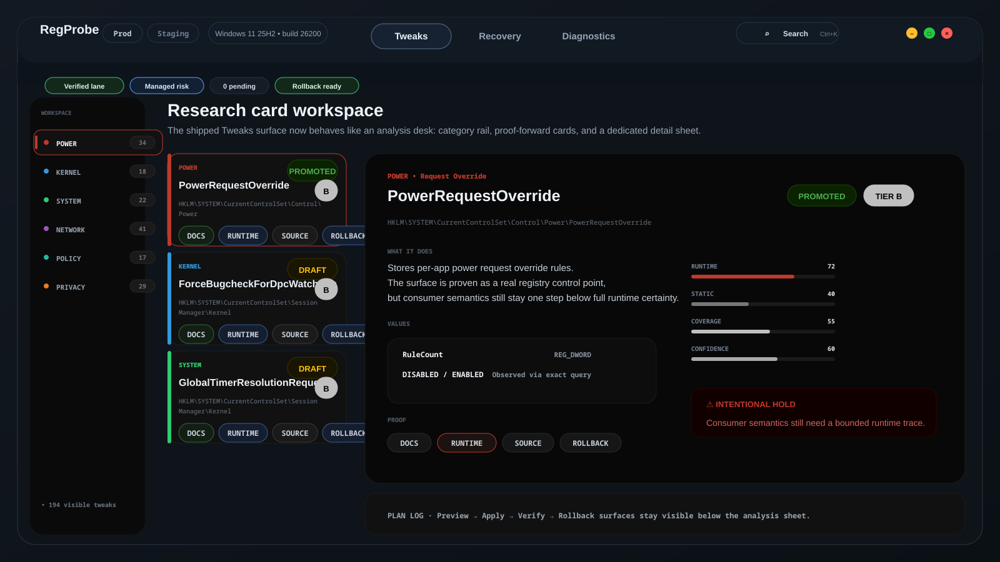
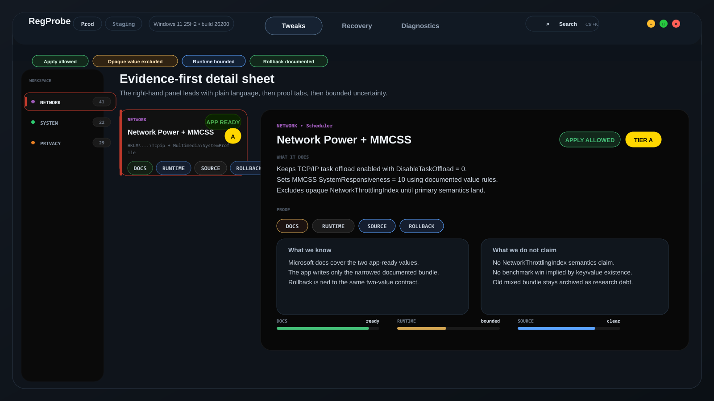
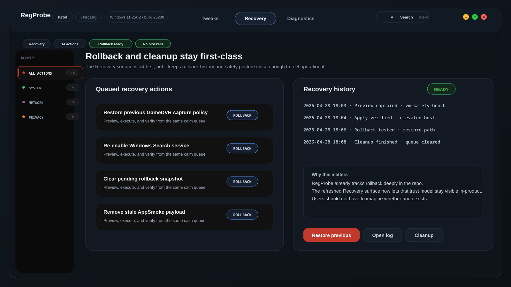
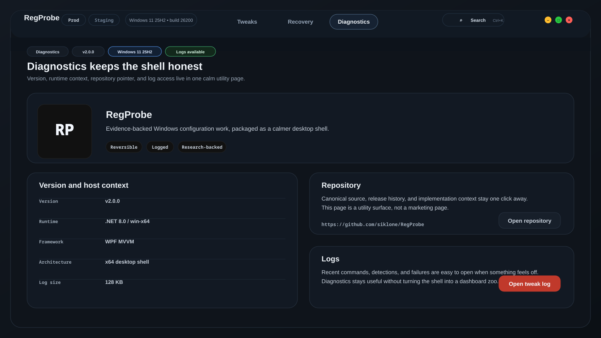
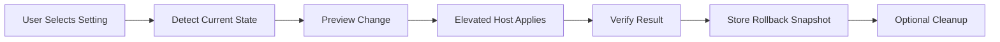

# RegProbe

<p align="center">
  
</p>

**Evidence-first Windows registry research and safer configuration tooling.**

RegProbe investigates, validates, and applies Windows registry-backed settings with a strong bias toward proof, reversibility, and controlled rollout. Instead of treating registry advice like folklore, RegProbe treats every setting like a claim that needs evidence: what changes, why it matters, how it was validated, and how to undo it.

That is the public product promise and the repo contract underneath it. The desktop app is the checked-in user-facing surface. The research pipeline, VM lanes, traces, audits, and static-analysis exports are the proof system behind it.


[](https://github.com/siklone/RegProbe/actions/workflows/dotnet.yml)

## Product Preview

The repo keeps a small preview lane so the shipped shell is visible before the deeper research prose starts. The images below are the checked-in repo-tracked product captures described in [Product media](Docs/product/media.md).

<table>
  <tr>
    <td width="50%">
      
    </td>
    <td width="50%">
      
    </td>
  </tr>
  <tr>
    <td><strong>Tweaks workspace</strong><br>The main shell is now a research-card desk: category rail, stacked cards, proof chips, and a dedicated analysis sheet.</td>
    <td><strong>Evidence detail</strong><br>Plain-English effect, hold state, proof tabs, and analysis bars stay in one place instead of leaking into repo-only context.</td>
  </tr>
  <tr>
    <td width="50%">
      
    </td>
    <td width="50%">
      
    </td>
  </tr>
  <tr>
    <td><strong>Recovery</strong><br>Rollback and cleanup now feel first-class, with queue state and restore history visible in the same shell.</td>
    <td><strong>Diagnostics</strong><br>Version, repo context, and logs moved into a calmer utility page instead of hiding behind scattered menus.</td>
  </tr>
</table>

## What RegProbe Does

- Detects registry-backed setting state before making changes
- Shows what a change means before apply
- Separates standard app logic from elevated operations
- Tracks evidence quality per setting
- Records rollback expectations explicitly
- Distinguishes research-only findings from shippable actions

## What RegProbe Does Not Do

- Blindly apply popular tweak lists
- Treat community claims as proof
- Assume a policy surface proves runtime behavior
- Ship risky settings without rollback expectations
- Auto-apply changes on startup

## Safety Model

RegProbe follows this flow:

`Detect -> Preview -> Apply -> Verify -> Record rollback`

That means changes are meant to be deliberate, inspectable, and reversible.


```mermaid
flowchart LR
    A["User Selects Setting"] --> B["Detect Current State"]
    B --> C["Preview Change"]
    C --> D["Elevated Host Applies"]
    D --> E["Verify Result"]
    E --> F["Store Rollback Snapshot"]
    F --> G["Optional Cleanup"]
```

## How To Read A Setting

Every serious setting in RegProbe should answer four questions:

1. What is it?
2. How strong is the proof?
3. Can I safely apply it?
4. How do I undo it?

The longer contributor walkthrough lives in [How to read a record](Docs/research/how-to-read-a-record.md).

## Evidence Model

RegProbe separates three layers of confidence.

### 1. Control Surface Proof

This shows that Windows exposes or recognizes the setting.

- official documentation
- ADMX / CSP / policy mapping
- known registry write surface
- app or provider mapping

### 2. Runtime Proof

This shows that changing the value produces meaningful behavior on real systems or controlled VMs.

- VM before/after validation
- Procmon / ETW / WPR traces
- observed service or component reads
- controlled reproduction artifacts

### 3. Shipping Decision

This records whether RegProbe exposes the setting for users.

- apply allowed
- visible but blocked
- research-only
- archived or negative evidence
- revalidation required for newer builds

The proof model and vocabulary are documented in more detail in [Proof model and visual grammar](Docs/research/proof-model.md).

## Badge Legend

| Badge | Meaning |
|--------|---------|
| `Docs` | Official documentation or primary source found |
| `Policy` | ADMX, CSP, group policy, or control surface confirmed |
| `VM` | Tested in a controlled virtual environment |
| `Trace` | Runtime activity captured via Procmon, ETW, or WPR |
| `RE` | Reverse engineering supported interpretation |
| `Rollback` | Rollback path explicitly tested |
| `No-hit` | Researched, but runtime evidence is insufficient |
| `Experimental` | Not ready for normal user-facing apply flow |

## Status Meanings

| Status | Meaning |
|--------|---------|
| `Recommended` | Sufficient evidence and rollback confidence |
| `Experimental` | Promising, but still under validation |
| `Research-only` | Retained record, not safe to expose for apply |
| `Blocked` | Known control surface, insufficient runtime proof |
| `Rejected` | Closed promotion decision with a named evidence lane or deprecation reason |
| `Archived` | Retained to avoid rediscovering dead ends |

## Rejected Closure Ledger

Rejected does not mean "missing evidence" by default. When a setting is unsafe, platform-limited, protected by ACLs, deprecated, first-party-only, or non-reversible, RegProbe records that lane as a closure decision instead of keeping it in the active blocked queue.

Use [rejected-closure-ledger.md](registry-research-framework/audit/rejected-closure-ledger.md) to audit every rejected record. The gate contract keeps the old blocker context under `rejection_closure.superseded_blockers`, while `promotion_blockers` carries a compact `promotion-disposition-*` or `deprecated-record` closure label.

## Research Clean State

The current v3.6 research snapshot is zero-pending: no active blockers, no promotion-eligible limbo, no unclassified rejected records, and no invalid gate entries. Use [v36-clean-state-report.md](registry-research-framework/audit/v36-clean-state-report.md) for the combined audit contract and [app-retest-readiness-latest.md](registry-research-framework/audit/app-retest-readiness-latest.md) before manual Windows app retesting.

## Start Here

- I want to use the app: [User guide](Docs/product/user-guide.md)
- I want to sanity-check the app with a fresh user: [10-minute user test](Docs/product/10-minute-user-test.md)
- I want the public support story: [Support matrix](Docs/product/support-matrix.md)
- I want to build the app: [Build and run](#build-and-run)
- I want to contribute research: [Contributing](CONTRIBUTING.md)
- I want contributor tools inside the app: open Contributor Lab from a repo/dev build
- I want the contributor tooling map: [Research tooling map](Docs/research/tooling-map.md)
- I want to understand certified vs community runs: [Run tiers](Docs/research/run-tiers.md)

The docs are now split the same way the repo is meant to feel from the outside: [Docs/product](Docs/product/README.md) for public-facing usage and trust signals, [Docs/research](Docs/research/README.md) for contributor and validation depth.

Audience boundary: the WPF app is the end-user product. Python scripts and JSON
artifacts are the canonical contributor API for research, VM campaigns, app QA,
and agentic AI workflows. The .NET research CLI remains a compatibility surface;
prefer Python mirrors for new research work, especially on Linux hosts without
the Windows desktop runtime. The `tweak list/apply/revert` CLI path is retained
for advanced Windows/headless workflows, not for normal app users.

Contributor Lab is the app-side companion for that boundary. It appears only in
contributor/dev contexts and starts behind an acknowledgement gate. It shows
Windows/VM readiness, safe command packs, and research observations such as
Operator96 without promoting them to normal end-user cards.

## Single Setting Check

If you want to sanity-check one tweak, one registry value, or one path before opening the app, use the single-setting inspector. The Python mirror is the canonical contributor path; run the .NET CLI version only as a compatibility route inside the Windows VM or on a host with the desktop runtime installed.

```bash
# Host-safe inspector; does not require the Windows desktop runtime
python3 registry-research-framework/scripts/check_single_tweak.py SystemResponsiveness

# Ask whether specific values are tracked by that setting
python3 registry-research-framework/scripts/check_single_tweak.py SystemResponsiveness --expected-value 10 --expected-value 30000

# Emit the same inspection result as JSON
python3 registry-research-framework/scripts/check_single_tweak.py SystemResponsiveness --expected-value 10 --json
```

```powershell
# Equivalent .NET CLI path for Windows/VM or desktop-runtime hosts
dotnet run --project cli/cli.csproj -- research inspect SystemResponsiveness --expected-value 10 --expected-value 30000
```

That command reports:

- matching record and tweak ids
- promotion state and rollback support
- app card presence and documentation file
- tracked registry paths and value names
- app-written values
- whether requested values are present in tracked targets, app writes, profiles, or proof text
- linked evidence and nearby source hits

When you read an app card, treat the `CLAIM BOUNDARY` section as part of the product contract. `WHAT WE KNOW` describes the evidence-backed key, value, rollback, and promotion state. `WHAT WE DO NOT CLAIM` is just as important: key/value existence alone does not imply a benchmark win, ETW/WPR runtime proof, or complete undocumented semantics. For example, the app now surfaces `power.disable-network-power-saving.policy` for `DisableTaskOffload = 0` and `SystemResponsiveness = 10`, while the older mixed parent bundle keeps the opaque `NetworkThrottlingIndex` write only as archived audit context.

## Single Tweak App QA Plan

If you want to retest one app card end to end, generate the exact QA commands before opening the desktop app. The Python planner is the safest host-side option; it prints the same app, guest VM, and KVM commands without launching the Windows-targeted CLI.

```bash
# Generate the manual app-QA plan for one setting
python3 registry-research-framework/scripts/check_single_tweak_app_qa.py SystemResponsiveness

# Keep the value checks in the plan and emit the same result as JSON
python3 registry-research-framework/scripts/check_single_tweak_app_qa.py SystemResponsiveness --expected-value 10 --expected-value 30000 --json
```

```powershell
# Equivalent .NET CLI path for Windows/VM or desktop-runtime hosts
dotnet run --project cli/cli.csproj -- research qa-plan SystemResponsiveness --expected-value 10 --expected-value 30000 --json
```

That command gives you:

- the exact shipped tweak/card candidate that matches the query
- the direct desktop-app QA command using `--qa-run-tweak`
- the guest VM helper command using `scripts/vm/guest-app-tweak-qa.ps1`
- the KVM batch command if you want to drive the same check from the host
- the expected report fields and stage list to verify
- the linked research doc, rollback support, and evidence locations to sanity-check while the app is open

## Promoted App QA Batch

If you want to retest several shipped cards in one pass, generate or run a promoted app-QA batch. This is the host-safe mirror of `research qa-batch`: use the Python planner from Linux hosts, and use the .NET CLI in the Windows VM or on a desktop-runtime host.

```bash
# Plan a small promoted batch without touching the VM
python3 registry-research-framework/scripts/check_promoted_tweak_app_qa_batch.py --category Power --category Explorer --total-limit 4

# Run a live KVM batch across a hand-picked set of cards
python3 registry-research-framework/scripts/check_promoted_tweak_app_qa_batch.py --id power.disable-fast-startup --id power.disable-windows-search --id explorer.hide-empty-drives --id privacy.disable-find-my-device --run-kvm --json
```

That command gives you:

- the selected promoted/apply-allowed cards
- each card's research doc and rollback expectations
- the exact QA commands per card
- optional live KVM app-QA results collected in one host-side batch
- an audit snapshot in `registry-research-framework/audit/promoted-app-qa-batch-latest.json`

The latest batch file is only the newest run. If you want cumulative coverage across several live QA passes, also open:

- `registry-research-framework/audit/promoted-app-qa-batch-history.jsonl`
- `registry-research-framework/audit/promoted-app-qa-coverage-latest.json`
- `registry-research-framework/audit/promoted-app-qa-coverage-latest.md`

Current audit snapshot: as of 2026-05-12, app retest readiness is passing with `265` app-surface entries, `0` app-only backlog items, `261` apply-allowed records, and `0` missing rollback stories. Promoted app-QA coverage is `258/258` (`100.0%`) with no uncovered promoted app-QA candidates remaining. Re-run readiness and the batch checker after changing app providers, evidence promotion gates, rollback behavior, or card mapping.

The latest live retest also keeps two small operator artifacts:

- `registry-research-framework/audit/app-retest-vm-health-latest.json`
- `registry-research-framework/audit/single-tweak-check-systemresponsiveness-latest.json`
- `registry-research-framework/audit/app-visual-retest-20260512/visual-retest-report.md`

If a live card reports `already-applied`, that can be a valid pass: the app must still verify the desired value, keep the card/evidence contract intact, and skip standalone rollback only when no mutation was performed.

## Registry Value Experiment Lane

For pasted `reg add` batches or opaque power/kernel values, do not stop at "the key exists" or "the value is absent." Parse the batch into one-value experiments, then test present values with sensible alternates and send missing/opaque values through ETW, Procmon, or static-string evidence before closing them.

```bash
python3 scripts/registry/parse_reg_add_batch.py \
  --input pasted-reg-adds.txt \
  --json-output registry-research-framework/audit/registry-value-experiments/operator-batch.json \
  --markdown-output registry-research-framework/audit/registry-value-experiments/operator-batch.md
```

Boot-sensitive apply/reboot lanes must use `--require-domain-snapshot` or a disposable qcow2 overlay. The `pilot-perf-calculate-actual-utilization-0` artifact in `registry-research-framework/audit/registry-value-experiments/` is the safety example: `PerfCalculateActualUtilization=0` caused a reboot regression on the available VM profile and the image was not recovered by offline registry restore, NTFS repair, SFC, DISM, System Restore, or update uninstall.

## Retest Readiness Check

If you are about to retest the desktop app and want one quick truth pass first, use the `research readiness` check. The Python command below is the host-safe mirror for Linux; the .NET CLI command is equivalent when the Windows desktop runtime is available.

```bash
# Run the full app-retest readiness check
python3 registry-research-framework/scripts/check_app_retest_readiness.py

# Emit the same readiness report as JSON
python3 registry-research-framework/scripts/check_app_retest_readiness.py --json
```

That command checks:

- public docs truth and contributor-doc drift
- user-facing tweak catalog wording
- app-surface card coverage and linked record docs
- evidence corpus and evidence-atlas count consistency
- rollback story coverage for apply-allowed records
- latest KVM app publish/deploy smoke and lane-health status

## What Ships Today

The shipped app is a focused three-surface shell with persistent top-level navigation: `Tweaks`, `Recovery`, and `Diagnostics`. The checked-in UI is deliberately tighter than older builds: dark, card-first, and more interested in exposing research than in showing off.

- `Tweaks` is now an analysis desk. A category rail sits on the left, research cards stack in the center, and the selected item expands into a larger evidence-first detail sheet with proof tabs, hold state, and rollback context.
- `Recovery` reuses the same shell chrome but narrows the job to rollback, cleanup, and restore visibility. The queue and history are both visible enough to feel operational.
- `Diagnostics` opens the utility page titled `About & Diagnostics`, where version, runtime context, repository pointers, and local log access stay in one calmer place.

That restraint is intentional. Older surfaces such as the hardware dashboard, services browser, bloatware browser, startup manager, disk-health area, and the older policy-heavy shell are not part of the checked-in shipped experience. Contributor-only evidence metadata still exists, but it stays behind repo and developer gating instead of turning the app into a research database with buttons.

## For Contributors

Everything below this point is mostly contributor depth: evidence policy, VM workflow, research health, audit surfaces, and the mechanics used to decide whether a tweak is safe enough to ship. If you only wanted the quick adoption path, you can stop at the build and run section and come back later.

## Core Principles

RegProbe does not mutate the system on startup. SAFE tweaks follow `Detect -> Apply -> Verify -> Rollback`, and elevated work goes through `RegProbe.ElevatedHost` instead of the main process. The happy path is not "click and hope"; it is "preview, apply deliberately, verify, and keep a restore story."

Runtime validation belongs in the VM, not on the host. If a setting touches kernel, boot, driver, power, or system policy behavior, the repo expects a mapped runtime lane before that evidence is treated as executed proof. Static analysis can narrow the path, but it does not get to pretend it is a live capture.

The research posture is evidence-first, not folklore-first. The checked-in v3.6 publishing lane retains the v3.2 static-hardening cleanup constraints: committed Ghidra artifacts remain PDB-backed and bounded, the broken-link and ghidra-bloat queues remain closed, Nohuto priority records were re-audited first, and `IDA` remains optional while `Ghidra + PDB` remains the primary checked-in static lane.

## Evidence Contract

This section stays technical because it is the contributor contract. The first quality-hardening pass changed what counts as evidence:

- `full-evidence.json.artifact_refs` are structured objects, not loose strings.
- Every physical artifact carries `path`, `sha256`, `size`, and `collected_utc`.
- `staged` manifests are allowed as planning state, but they are not treated as captured evidence.
- Runtime lanes that claim live capture must point to physical ETL, PML, JSON, or equivalent artifacts, or they are downgraded to `missing-capture`.
- Kernel, boot, and driver-facing records must finish with a real mapped runtime lane before they can count as executed evidence.

If you see a manifest without capture artifacts, treat it as orchestration metadata, not proof.

## Where The Research Stands

The research workspace is now less about running one-off experiments and more about keeping a living, auditable map of what has been proven. It tracks evidence freshness by tested Windows build, keeps regression history for revalidation after major build changes, records tweak interactions and dependency datasets, and carries anti-cheat or DRM advisory risk tags where they are known. The checked-in validation baseline also has a reproducibility manifest, so a future run can tell whether it is comparing like with like.

Negative evidence matters here. Archived and no-hit records are not just shrugged away; their failed traces, missing captures, and narrowed hypotheses are published so the same dead ends do not get rediscovered later. Entry points are the [Regression history](research/regression-history.json), the [Negative evidence index](research/evidence-not-found/index.json), and the retained historical [Pipeline v3.1](registry-research-framework/docs/pipeline-v3.1.md) notes.

Collection mode is explicit now. `evidence` is the safe default for research and audits: automatic rollback is suppressed, pre-change and post-change exports are expected, and manifests carry `rollback_pending = true` until a later explicit cleanup run. `operational` keeps the older convenience behavior for flows where automatic rollback is intentionally allowed, but it is not the default for evidence collection.

VM secret handling was also tightened. Repo-tracked VM scripts no longer keep plaintext guest passwords. Credentials are resolved from explicit input first, then environment variables such as `REGPROBE_VM_GUEST_USER` and `REGPROBE_VM_GUEST_PASSWORD`, and finally from a DPAPI-protected CLIXML credential file referenced outside the repo. `vmrun` still consumes credentials at invocation time because that is a VMware CLI limitation, but the repo avoids storing or logging those secrets directly and the shared VM helper masks them in runner output.

For hard runtime cases, the escalation path extends beyond "reboot and idle." The checked-in path moves from targeted `ETW` or runtime trace work, to the safe mega-trigger runtime lane, to `WinDbg` boot registry tracing when QGA allows it, and then to source-enrichment cross-reference through `ReactOS`, `WRK`, `System Informer`, `Sandboxie`, `Wine`, `ADMX`, and `WDK`. ETL discovery feeds the queue, feature-area enrichment and triage narrow the candidate set, VM safety bench results promote only the profiles that meet the retained bar, and hard blockers record the missing prerequisite instead of collapsing into generic review language. The v3.6 clean-state checkpoint has no active blocked worklist; rejected and held records are retained as classified audit history instead of active execution debt.

For the full validation flow, start with the [VM workflow](Docs/research/vm-workflow.md), [Runtime escalation](Docs/research/runtime-escalation.md), and the historical [Pipeline v3.1](registry-research-framework/docs/pipeline-v3.1.md) reference when an older audit pack still points to it.

## Research Health

<!-- BEGIN:RESEARCH_HEALTH -->
| Metric | Value |
|--------|-------|
| Promoted | 256 |
| Blocked | 3 |
| Revalidation Pending | 0 |
| Gate Health | 🟡 yellow |
| Schema Complete | 100% |
| Missing Docs | 17 |
| Blocked Actionability | 3 active |
| Blocked Worklist Gate | PASS |
| Blocked Worklist | `registry-research-framework/audit/blocked-worklist.md` |
<!-- END:RESEARCH_HEALTH -->

## Repo Shape

```text
app/                         WPF shell, views, view models, resources
core/                        Contracts and shared models
engine/                      Tweak implementations and execution pipeline
infrastructure/              Registry, file, process, and elevation adapters
elevated-host/               Separate admin helper process
cli/                         Command-line entry point
tests/                       Unit and behavior tests
research/                    Human-facing records, notes, audit outputs
evidence/                    Bundles and imported runtime/static artifacts
registry-research-framework/ historical v3.1/v3.2 machine-pipeline docs and retained tooling
Docs/                        Workflow and contributor-facing docs
scripts/                     Build, package, VM, and validation helpers
```

## VM Reality

The supported validation VM is `Win25H2Clean`, and the checked-in canonical snapshot is `RegProbe-Baseline-ToolsHardened-20260330`.

The baseline is tooling-first. Defender stays enabled, exclusions are bounded to trusted tooling, app payloads do not persist in the saved baseline, and app launch smoke is allowed only as an ephemeral deploy/validate/cleanup lane. The details matter because registry evidence collected from a messy VM is worse than no evidence: it looks authoritative while quietly carrying someone else's state.

Start with the [VM workflow](Docs/research/vm-workflow.md) when you need the whole flow, and use [Runtime escalation](Docs/research/runtime-escalation.md) when a value needs more than a simple before/after check.

### VM Health And QGA Launch

KVM runners that rely on QEMU Guest Agent now fail fast before launching guest work. Run the non-mutating health check first when ETW, WPR, or Ghidra produces a transport-looking failure:

```bash
python3 scripts/vm-kvm/vm-health-check.py --domain regprobe-win11-25h2-session --connect qemu:///session --json
```

Decision tree: if `domstate` is not `running`, start or restore the VM before collecting evidence. If `guest_ping`, `guest_info`, or `guest_exec` fails, repair QGA in the guest or rerun the health check; do not treat a downstream `ensure-admin-shell` timeout as evidence. If QGA is healthy, keep the default `--launch-transport auto --preflight require` path for ETW/Ghidra. Use `--launch-transport send-key` only when you intentionally want the interactive fallback, and expect summaries to record `launch_transport=send-key`.

When recovering old blocked evidence, prefer a small QGA-first retry over dragging stale guest artifacts into the repo. The current repeatable pattern is a narrow ETW stackwalk with `--stackwalk-event RegQueryValue`, small buffers, `--ingest-to-repo`, and the default QGA preflight. Keep raw tracerpt XML ignored, commit the summary, ETL, normalized bundle, and `evidence/captures/...` receipt, then refresh the published research surfaces with `python3 scripts/refresh_research_publish_surfaces.py`.

## Scripts

The repo has a lot of PowerShell, but not every script has the same job. Some scripts are everyday build, package, clean, baseline maintenance, shell-health, and app-smoke helpers. Some are active research runners for checked-in escalation lanes. Others are historical reproducibility scripts kept because old notes, audits, and evidence bundles still depend on them.

Regenerable clutter such as `bin/`, `obj/`, `publish/`, `dist/`, and `TestResults/` can be cleaned freely. Narrow `.ps1` runners need additional review because many exist so an old evidence claim can still be replayed. Review the [Script catalog](Docs/research/script-catalog.md) before deleting anything that looks oddly specific.

## Where To Start If You Want To Learn

Start with this [README](README.md) and [Contributing](CONTRIBUTING.md), then move to the [VM workflow](Docs/research/vm-workflow.md) and the [script catalog](Docs/research/script-catalog.md). After that, open the [research atlas](research/evidence-atlas.md), pick one record under [research/records](research/records), and read it next to its matching bundle under [evidence/records](evidence/records). That path gives you the "what", the "how", and the proof trail in the same order most contributors discover it.

## Download

The latest release is available on the [Releases page](https://github.com/siklone/RegProbe/releases/latest).

### Verify The Download

Each release includes a SHA256 checksum file.

```powershell
Get-FileHash .\RegProbe-Portable-v0.0.0-win-x64.zip -Algorithm SHA256
```

Compare the output against the `RegProbe-<version>-win-x64-sha256.txt` file published with the same release.

### Available Packages

| Package | Description |
|--------|-------------|
| `RegProbe-Portable-<version>-win-x64.zip` | Portable desktop build |
| `RegProbe-Cli-<version>-win-x64.zip` | CLI-only package for scripted workflows |
| `RegProbe-<version>-win-x64-sha256.txt` | SHA256 checksums for release verification |

## CLI Reference

RegProbe includes a CLI for scripted and audit-friendly workflows. The short version lives here; the fuller command guide is in [Docs/product/cli.md](Docs/product/cli.md).

```powershell
# Preview a tweak without applying it
dotnet run --project cli/cli.csproj -- tweak apply system.disable-game-recording-broadcasting

# Apply with verify + rollback-on-failure
dotnet run --project cli/cli.csproj -- tweak apply system.disable-game-recording-broadcasting --apply

# Roll back to the previous state
dotnet run --project cli/cli.csproj -- tweak revert system.disable-game-recording-broadcasting --apply
```

## Build And Run

### Prerequisites

- Windows 10 or Windows 11
- .NET 8 SDK
- PowerShell 7+ used by the checked-in script lane

### Build

```powershell
dotnet build RegProbe.sln -c Release
```

If your host does not expose `dotnet` on `PATH`, use the repo-local wrappers instead:

```bash
./dotnetw build RegProbe.sln -c Release -p:EnableWindowsTargeting=true
```

```powershell
.\dotnetw.ps1 build RegProbe.sln -c Release
```

### Run

```powershell
dotnet run --project app/app.csproj
```

### Test

```powershell
dotnet test tests/tests.csproj -c Release --no-build -v minimal
```

On hosts using the repo-local SDK:

```bash
./dotnetw test tests/tests.csproj -c Release --no-build -v minimal -p:EnableWindowsTargeting=true
```

If a Linux host can build `net8.0-windows` but cannot execute the WPF testhost because `Microsoft.WindowsDesktop.App` is unavailable, run the tests in the KVM Windows guest instead:

```bash
# Build the test output on the host first if needed
./dotnetw build tests/tests.csproj -c Release -p:EnableWindowsTargeting=true

# Stage test output plus repo data into the VM and run the WindowsDesktop suite there
python3 scripts/vm-kvm/run-guest-dotnet-tests.py --wait-timeout 1800
```

That VM runner stages `tests/bin/Release/net8.0-windows`, `Docs`, `research/records`, and `research/promotion-gates.json` under `C:\RegProbe` before calling the guest SDK. Use `--filter <expression>` for a single C# test.

### Package

```powershell
pwsh -File scripts/package_windows.ps1 -Configuration Release -Runtime win-x64
```

### Publish

```powershell
pwsh -File scripts/publish_release.ps1
```

## Entry Points

Most day-to-day contributors will want [Contributing](CONTRIBUTING.md), [How to read a record](Docs/research/how-to-read-a-record.md), [Proof model and visual grammar](Docs/research/proof-model.md), [VM workflow](Docs/research/vm-workflow.md), [Runtime escalation](Docs/research/runtime-escalation.md), [Script catalog](Docs/research/script-catalog.md), [Tweak sources](Docs/TWEAK_SOURCES.md), the [Research readme](research/README.md), the [Evidence atlas](research/evidence-atlas.md), and the checked-in [Evidence audit](research/evidence-audit.json).

## License

This project is licensed under the MIT License. See [LICENSE](LICENSE).

## Studio Note

Built with Codex for the heavy lifting and occasional Claude passes on design and review. Everything here is hand-directed and repo-specific. The tools help carry the weight; the direction, judgment, and weird little scars are all from working through this repo for real.
