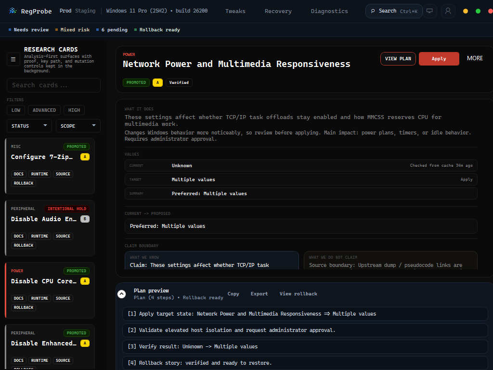
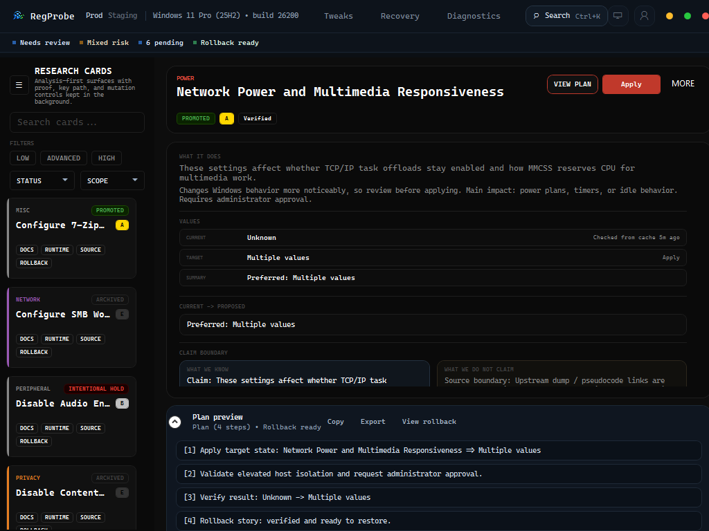
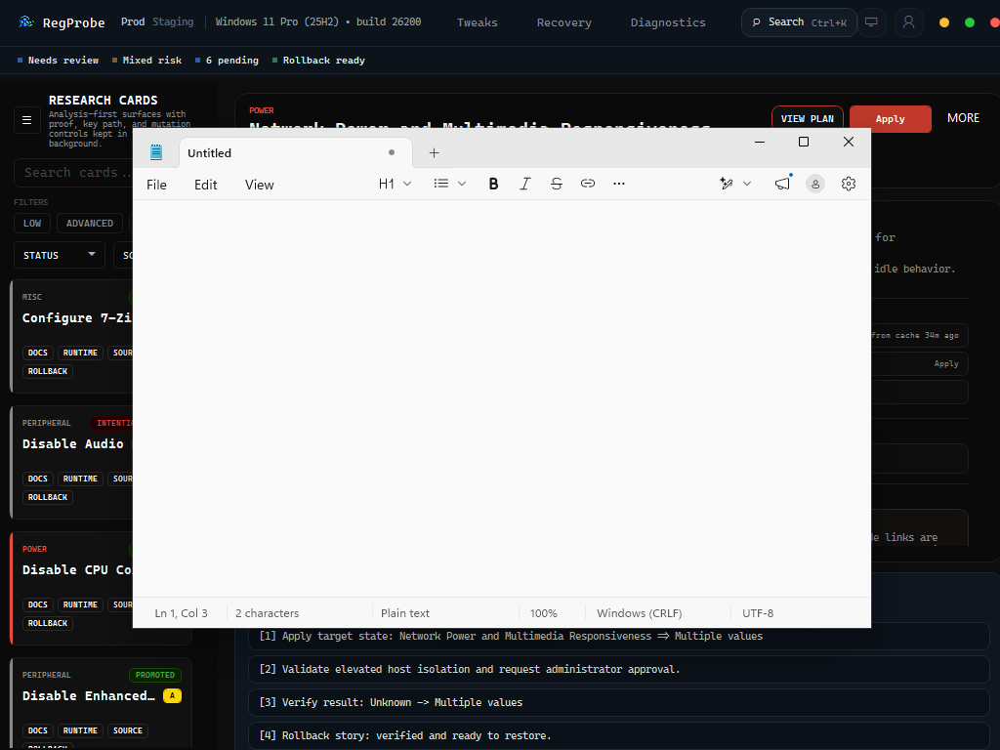

# App Visual Retest - 2026-05-12

Status: `ok`

Target card: `power.disable-network-power-saving.policy`

Visible title: `Network Power and Multimedia Responsiveness`

## What Was Verified

- Startup navigation opened the Tweaks workspace directly on the target card via `--open-tweak`.
- The plan drawer opened via `--expand-plan`.
- The card showed `PROMOTED`, `A`, and `Verified` badges.
- Proof-lane pills were visible on the card list: `DOCS`, `RUNTIME`, `SOURCE`, and `ROLLBACK`.
- Claim-boundary copy was visible in the detail panel.
- Apply and More actions were visible.
- The plan drawer showed a rollback-ready four-step plan, including the final rollback story.
- A live QA apply/verify/rollback pass completed while the visual retest window stayed open, proving `--qa-run-tweak` uses an isolated single-instance key instead of forwarding arguments into the manual window.

## Screenshots

## Linked QA Truth

- `registry-research-framework/audit/single-tweak-app-qa-systemresponsiveness-live-latest.json`
- `registry-research-framework/audit/promoted-app-qa-batch-latest.json`
- `registry-research-framework/audit/promoted-app-qa-coverage-latest.json`
- `registry-research-framework/audit/app-retest-readiness-latest.json`

## Boundary

This is a visual/manual retest artifact. Apply, verify, rollback, and card snapshot contract truth remains in the linked JSON QA reports.
